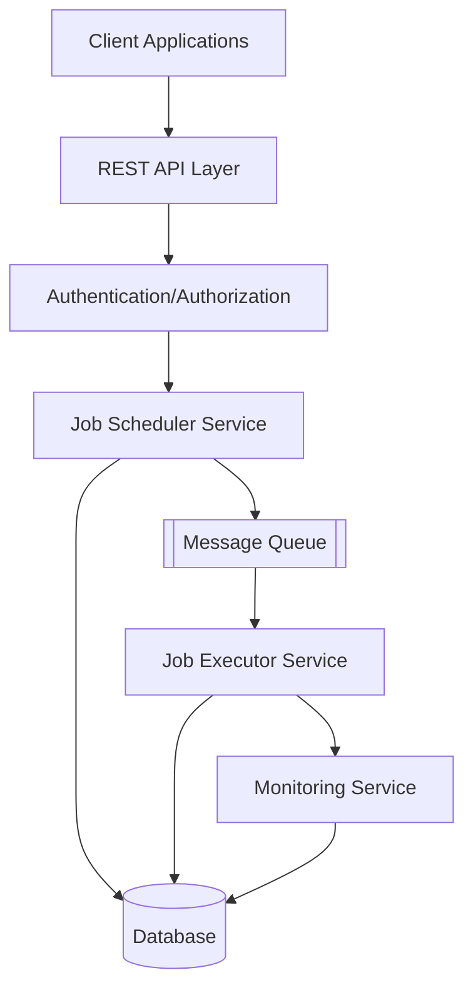
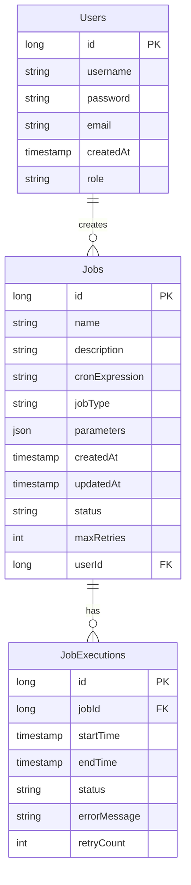

1. Project Name: Chronos - Job Scheduling System

2. System Design:




Key Components:
- REST API Layer: Handles all incoming requests
- Authentication Service: Manages user authentication and authorization
- Job Scheduler Service: Manages job scheduling and queuing
- Job Executor Service: Executes jobs and handles retries
- Monitoring Service: Tracks job status and system health
- Database: Stores job and user information
- Message Queue: Manages job execution queue

3. Database Design:



4. Key APIs:

a. User Management
```
Endpoint: /api/v1/users/register
Method: POST
Description: Register a new user
Request: {
    "username": "string",
    "password": "string",
    "email": "string"
}
Response: {
    "id": "long",
    "username": "string",
    "email": "string"
}
```

b. Job Management
```
Endpoint: /api/v1/jobs
Method: POST
Description: Create a new job
Request: {
    "name": "string",
    "description": "string",
    "cronExpression": "string",
    "jobType": "string",
    "parameters": {},
    "maxRetries": "int"
}
Response: {
    "id": "long",
    "name": "string",
    "status": "string"
}

Endpoint: /api/v1/jobs/{id}
Method: GET
Description: Get job details
Response: {
    "id": "long",
    "name": "string",
    "description": "string",
    "status": "string",
    "executions": []
}

Endpoint: /api/v1/jobs/{id}/cancel
Method: POST
Description: Cancel a job
Response: {
    "message": "string",
    "status": "string"
}
```

c. Job Execution
```
Endpoint: /api/v1/jobs/{id}/executions
Method: GET
Description: Get job execution history
Response: [{
    "id": "long",
    "startTime": "timestamp",
    "endTime": "timestamp",
    "status": "string",
    "errorMessage": "string"
}]
```

Overall Approach:

1. Technologies:
- Spring Boot: For building the REST APIs and core application
- Spring Security: For authentication and authorization
- Quartz Scheduler: For job scheduling and management
- MySQL: For persistent data storage
- RabbitMQ: For message queuing
- JWT: For stateless authentication
- Lombok: For reducing boilerplate code
- Spring AOP: For logging and monitoring

2. Implementation Strategy:
- Start with core job scheduling functionality using Quartz
- Implement basic CRUD operations for jobs
- Add authentication using Spring Security and JWT
- Implement job execution with retry mechanism
- Add monitoring and logging
- Implement message queue for job execution
